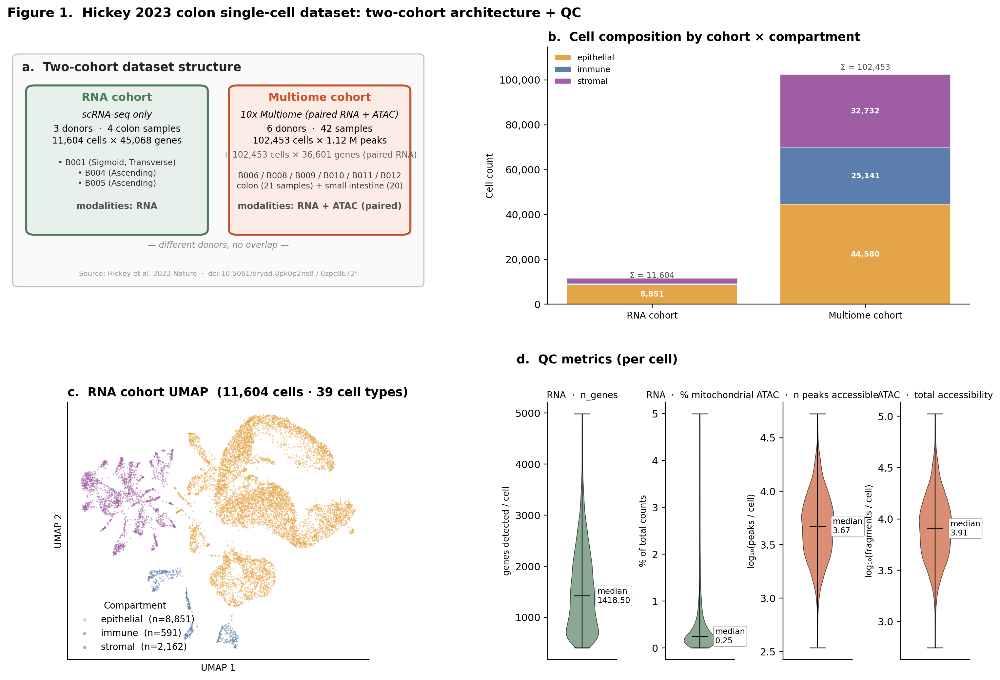
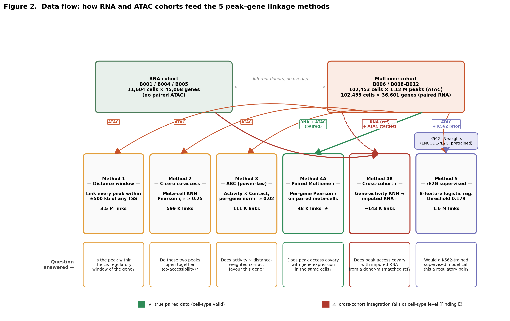
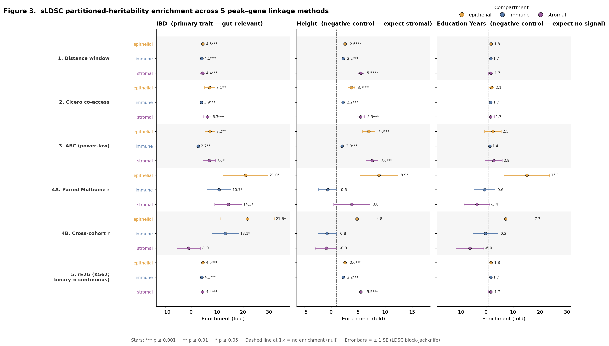
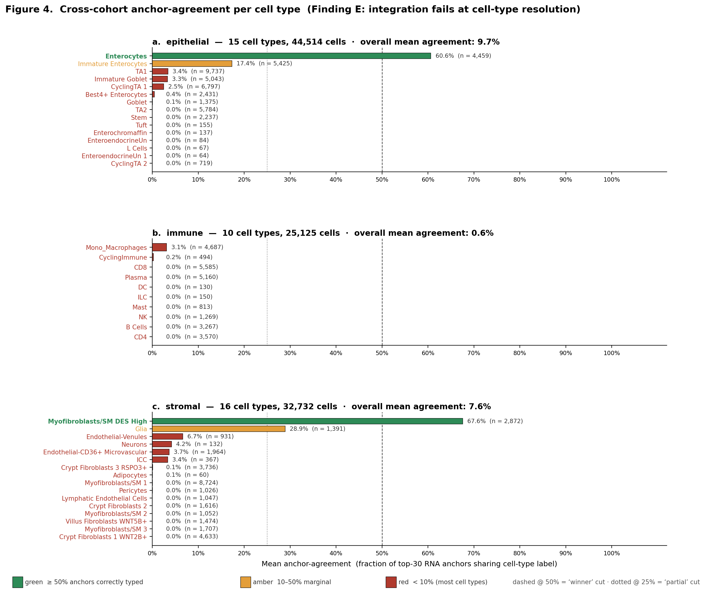

# GutCRE Benchmark

**A reproducible benchmark of five peak–gene linkage methods on single-cell multi-omic colon data, evaluated by their ability to partition inflammatory-bowel-disease (IBD) GWAS heritability.**

[](https://www.python.org)
[](https://scanpy.readthedocs.io)
[](LICENSE)

---

## The question in one sentence

Given paired scRNA-seq and scATAC-seq from human colon tissue, **which peak–gene linkage method is most informative about IBD genetic risk?**

## Why this matters

Genome-wide association studies have linked thousands of variants to complex diseases like IBD. Most of these variants lie in *non-coding* regions, so translating them into biological mechanism requires identifying which gene(s) each regulatory variant controls. A number of computational methods propose peak–gene linkages from single-cell multi-omic data, but they rest on different assumptions (geometry, co-accessibility, regulatory activity, direct correlation, or supervised learning). This project systematically compares five of the most-cited methods on a common colon dataset and tests how well each method's links concentrate disease heritability — the concrete question a disease-gene-discovery team needs answered before choosing a pipeline.

## What gaps in the field does this address?

Recent single-cell multi-omics publications (Hickey 2023, Gschwind 2025, Bravo González-Blas 2023, Cao & Gao 2022, among others) have each introduced or improved a peak–gene linkage strategy. Two practical issues remain open:

1. **No head-to-head benchmark on a common dataset.** Each publication evaluates its own method in isolation, often against different ground-truth sources (CRISPR, eQTL, Hi-C) and in different cell types. A disease-gene-discovery team trying to choose a method doesn't have a clean comparison to guide them. *This project runs five established methods on the same colon atlas and ranks them by how well their links partition IBD GWAS heritability — a disease-relevant, biologically grounded metric that applies uniformly across all methods.*

2. **Cross-cohort integration quality is rarely audited.** Standard pipelines (Seurat, Signac, ArchR, SCENIC+) integrate unpaired RNA and ATAC via gene-activity-bridge anchor transfer. This works at the aggregate level but can silently fail at cell-type resolution. Published analyses typically do not diagnose whether the integration preserves cell-type identity at the anchor level. *This project introduces a simple diagnostic — checking what fraction of each cell's top-K anchors share its cell-type label — and shows that for most cell types in the Hickey atlas, the integration fails this test (Figure 4). The diagnostic is <30 lines of code and runs in under a minute; adding it to existing pipelines is a low-cost / high-value upgrade.*

3. **Pretrained supervised models are applied to new cell types without recalibration.** The ENCODE-rE2G model was calibrated on K562; applied directly to gut tissue, the K562 decision threshold makes it numerically indistinguishable from a simple distance baseline. Papers using pretrained models in new tissues rarely flag this as a caveat. *This project documents the failure mode (Method 5 collapses onto Method 1) and provides a concrete alternative: use rank-based or continuous scoring instead of the K562 binary threshold.*

Together, these contributions turn the peak–gene linkage literature from "here's my method, it works in my system" into a comparative, disease-relevant ranking — with a quality-control diagnostic that any subsequent cross-cohort integration pipeline should include.

## Five methods, one benchmark

| # | Method | Core idea | Input modalities |
|---|--------|-----------|-----------------|
| 1 | **Distance window** | Every peak within ±500 kb of a gene TSS | ATAC |
| 2 | **Cicero-style co-accessibility** | Peak–peak correlation in KNN meta-cells | ATAC |
| 3 | **Activity-by-Contact (ABC)** | Activity × distance-decayed contact | ATAC |
| 4A | **Paired-Multiome correlation** | Direct ATAC × RNA correlation (same cells) | paired ATAC+RNA |
| 4B | **Cross-cohort anchor transfer** | Integrate RNA from a reference cohort → correlation | ATAC + independent RNA |
| 5 | **ENCODE-rE2G** | Pretrained supervised model (CRISPR-validated) | ATAC + rE2G pickle |

All five methods are implemented as self-contained Python scripts (`scripts/linkage/method1_distance.py` through `method5_re2g.py`), with a shared unified output schema so their outputs are directly comparable. Each script reproduces the canonical algorithm from its primary citation — details in [`docs/methods.md`](docs/methods.md).

## Headline findings

**1. Paired Multiome gives the cleanest signal per SNP.**
Method 4A concentrates IBD heritability 10–21× in just 0.2–0.5 % of SNPs (p ≤ 0.05 across all three gut compartments).

**2. Cross-cohort anchor-transfer integration can silently fail at cell-type resolution.**
Compartment-aggregate metrics look reasonable, but a per-cell anchor-agreement diagnostic reveals that most cell types have < 10 % correctly typed anchors — a field-level caveat for any pipeline using standard gene-activity-bridge integration.

**3. Pretrained supervised models (rE2G) don't transfer off-the-shelf.**
The K562-calibrated threshold makes rE2G indistinguishable from the distance baseline on gut data, at either binary or continuous scoring.

**4. Negative controls validate the pipeline.**
Height GWAS enrichment correctly concentrates in the stromal compartment (p ≤ 10⁻⁹) — the biology predicted by bone/connective-tissue regulation.

See [`results/DISCUSSION.md`](results/DISCUSSION.md) for full interpretation and [`results/figures/fig3_ldsc_benchmark.png`](results/figures/fig3_ldsc_benchmark.png) for the main benchmark figure.

## Figures

Four publication-quality figures in `results/figures/` (PNG + PDF each). See [`results/FIGURES_AND_TABLES.md`](results/FIGURES_AND_TABLES.md) for the full index and [`results/DISCUSSION.md`](results/DISCUSSION.md) for interpretation.

### Figure 1 — Dataset overview and QC
<p align="center">
  
</p>

*Two-cohort dataset structure (RNA-only + Multiome), per-compartment cell composition, RNA UMAP coloured by compartment, and per-modality QC metrics.*

### Figure 2 — Data flow across the five methods
<p align="center">
  
</p>

*How RNA and ATAC from the two cohorts feed each of the five peak–gene linkage methods, with a ribbon showing the concrete question each method answers.*

### Figure 3 — sLDSC benchmark (main result)
<p align="center">
  
</p>

*Forest plot of heritability enrichment ± SE across 6 methods × 3 compartments × 3 traits; IBD is primary, Height and Educational Attainment are negative controls.*

### Figure 4 — Cross-cohort anchor-agreement diagnostic
<p align="center">
  
</p>

*Per-cell-type anchor-agreement in cross-cohort integration: most cell types have near-zero agreement (red bars), revealing a silent failure mode that aggregate metrics miss.*

## Repository structure

```
github.ver/
├── README.md                    # this file
├── environment.yaml             # conda env spec (Python + libraries) — used once at install
├── config/config.yaml           # analysis parameters + reference paths — used every run
├── docs/
│   ├── project_overview.md      # audience: HR / hiring manager
│   ├── methods.md               # educational walkthrough of each method
│   └── results_summary.md       # plain-English findings
├── scripts/
│   ├── data/                    # Dryad downloader + Hickey loader
│   ├── linkage/                 # methods 1–5 + cross-cohort integration diagnostic
│   ├── ldsc/                    # sLDSC annotation → LD scores → h² pipeline
│   └── figures/                 # reproducible figure + table generators
├── notebooks/
│   └── 01_hickey_qc_executed.ipynb      # QC + clustering + cell-type annotation
└── results/
    ├── DISCUSSION.md                 # narrative writeup (~1,260 words, 16 citations)
    ├── FIGURES_AND_TABLES.md         # index + quick-reference
    ├── figures/fig1–4.png            # 4 figures (PNG)
    ├── tables/table1–3.tsv           # 3 tables (TSV, machine-readable)
    └── linkage/ + ldsc/              # raw per-method outputs + sLDSC results
```

**A note on `environment.yaml` vs `config/config.yaml`:** `environment.yaml` is the tooling spec (Python version + library versions, used only by `conda env create`). `config/config.yaml` is the analysis parameter file (thresholds, windows, reference paths, loaded by scripts at runtime). Keeping them separate is standard practice — they have different lifecycles and different consumers, and merging them would conflate environment reproducibility with analysis tuning.

## Quick-start

```bash
conda env create -f environment.yaml
conda activate omics

# Download reference files (one-time, ~3 GB)
# see scripts/data/download_hickey_dryad.py for details

# Run the five linkage methods (each takes --all-compartments)
python scripts/linkage/method1_distance.py --all-compartments \
    --gtf data/raw/reference/gencode.v44.annotation.gtf.gz \
    --chrom-sizes data/raw/reference/hg38.chrom.sizes \
    --out-dir results/linkage/method1/

# Build sLDSC annotations, compute LD scores, run partitioned heritability
python scripts/ldsc/build_annotations.py --all
python scripts/ldsc/compute_ldscores.py --all --parallel 4
python scripts/ldsc/run_h2.py --all --parallel 6
python scripts/ldsc/aggregate_results.py

# Regenerate figures and tables from scratch
python scripts/figures/figure1_data_overview.py
python scripts/figures/figure3_ldsc_benchmark.py   # main benchmark figure
python scripts/figures/make_tables.py
```

## Runtime reference

Wall-clock times from a development run on Apple M-series (macOS, `omics` conda env, 10-core parallel where applicable). Data-loading / sLDSC steps dominate.

### Per-script runtimes

| Stage | Script | Typical runtime | Notes |
|-------|--------|----------------:|-------|
| Data | `scripts/data/download_hickey_dryad.py` | manual (user clicks) | ~10 min of clicks + downloads |
| Data | `scripts/data/load_hickey.py --mode rna` | ~2 min | 4 RNA-only samples |
| Data | `scripts/data/load_hickey.py --mode rna-multiome` | ~10–15 min | 42 Multiome samples; large MTX files |
| Data | `scripts/data/load_hickey.py --mode atac --source peaks` | ~3–5 min | 3 compartment peak matrices |
| Linkage | `scripts/linkage/method1_distance.py --all-compartments` | ~3.5 min | bedtools slop + intersect |
| Linkage | `scripts/linkage/method2_cicero.py --all-compartments` | ~15–20 min | LSI + KNN meta-cells + per-chrom Pearson |
| Linkage | `scripts/linkage/method3_abc.py --all-compartments` | ~1–2 min | vectorised per-gene normalisation |
| Linkage | `scripts/linkage/method4_paired.py --all-compartments` | ~10–15 min | paired barcode matching + meta-cell correlation |
| Linkage | `scripts/linkage/method4_crosscohort.py --all-compartments` | ~18–25 min | anchor KNN transfer is the bottleneck |
| Linkage | `scripts/linkage/method4b_anchor_diagnostic.py --all` | ~3 min | per-compartment anchor agreement |
| Linkage | `scripts/linkage/method5_re2g.py --all-compartments` | ~1–2 min | features → pretrained LR predict |
| sLDSC | `scripts/ldsc/build_annotations.py --all` | ~60 min | 18 annotations × 22 chroms (liftover + make_annot) |
| sLDSC | `scripts/ldsc/build_method5_continuous.py --all` | ~1 min | 3 continuous annotations |
| sLDSC | `scripts/ldsc/compute_ldscores.py --all --parallel 4` | **~5 hours** | 21 annotations × 22 chroms; dominant step |
| sLDSC | `scripts/ldsc/run_h2.py --all --parallel 6` | ~25–35 min | 63 (trait, annotation) combinations |
| sLDSC | `scripts/ldsc/aggregate_results.py` | ~1 s | parses .results/.log files |
| Figures | `scripts/figures/figure{1,2,3,4}_*.py` | 5–30 s each | matplotlib rendering |
| Figures | `scripts/figures/make_tables.py` | ~1 s | pandas → TSV/MD/LaTeX |

### End-to-end total
Full pipeline from raw Dryad downloads to final figures: **~7–8 hours wall-clock**, of which ~5 hours is LD score computation.

### First-time setup (one-off, not re-run)
- Reference data downloads (1000G, baseline-LD, HapMap3, GWAS sumstats): ~10 min of clicking + ~1 GB download
- Conda env build (`environment.yaml`): ~5 min
- LDSC env build (`bioconda ldsc` via Rosetta): ~5 min
- ENCODE-rE2G clone: ~1 min

---

## What this project demonstrates

This is a methods-benchmark project involving **multi-modal single-cell data integration**, **statistical genetics (sLDSC partitioned heritability)**, **reproducible pipeline design**, and **careful interpretation of method trade-offs**. Technical skills shown include:

- Single-cell RNA-seq + ATAC-seq QC, clustering, and cell-type annotation (scanpy, snapATAC2)
- Multi-modal integration via anchor transfer, KNN in shared latent spaces, and paired-barcode correlation
- Implementation of published enhancer-prediction methods from primary literature (Cicero, ABC, ArchR peak2gene, rE2G)
- Stratified LD-score regression pipeline (ldsc, Python 2.7 via Rosetta)
- Reproducible, scriptable figures and tables (matplotlib, pandas)
- Method comparison framed around a concrete biological question (disease heritability partitioning)

See [`docs/project_overview.md`](docs/project_overview.md) for an expanded educational description.

## Citations

- Hickey J. W. et al. *Nature* **619**, 572 (2023) — primary dataset
- de Lange K. M. et al. *Nat. Genet.* **49**, 256 (2017) — IBD GWAS
- Finucane H. K. et al. *Nat. Genet.* **47**, 1228 (2015) — sLDSC
- Fulco C. P. et al. *Nat. Genet.* **51**, 1664 (2019); Nasser J. et al. *Nature* **593**, 238 (2021) — ABC
- Pliner H. A. et al. *Mol. Cell* **71**, 858 (2018) — Cicero
- Granja J. M. et al. *Nat. Genet.* **53**, 403 (2021) — ArchR
- Stuart T. et al. *Cell* **177**, 1888 (2019) — Seurat/Signac anchor transfer
- Gschwind A. R. et al. *Nature* (2025) — ENCODE-rE2G

Full reference list in [`results/DISCUSSION.md`](results/DISCUSSION.md).

